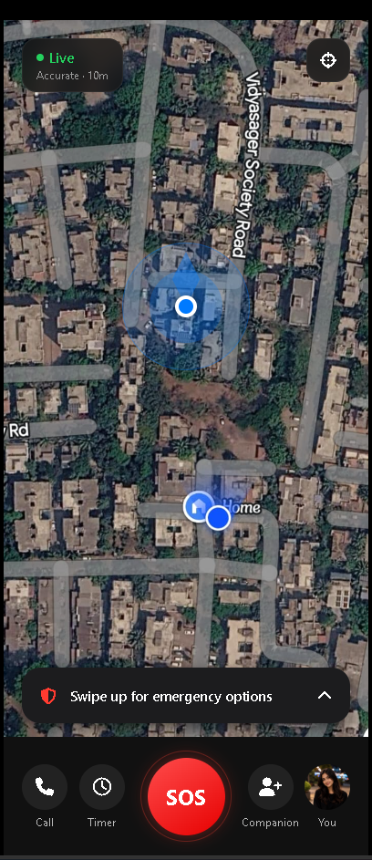
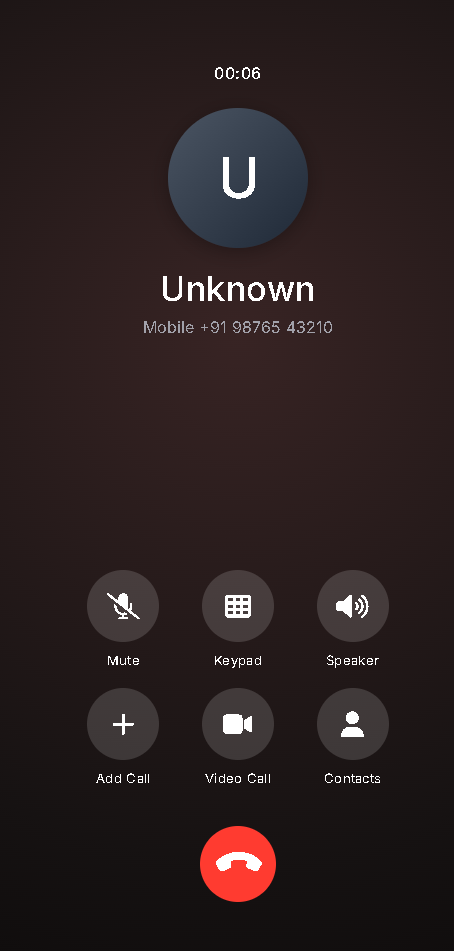
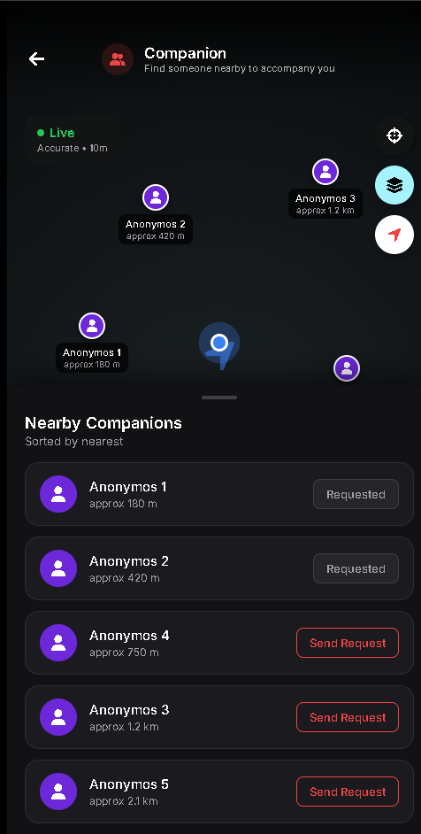

# SOS Mobile App (sos_ff) 🚨

A comprehensive personal safety and emergency SOS mobile application built with web technologies and packaged natively using Flutter. The app is designed to provide quick access to emergency features, simulated calls, and real-time location tracking to ensure personal safety.

## 🌟 Key Features
- **Live Location Tracking**: Satellite map view with real-time user location, accuracy radius, and a directional view cone.
- **Emergency SOS & Swipe Actions**: Quick access to emergency options with intuitive swipe-up gestures and a dedicated SOS button.
- **Fake / Scheduled Call**: Simulate incoming calls to escape uncomfortable situations. Fully customizable with caller name, number, photo, and gender. Includes realistic "Incoming" and "Active Call" screens.
- **Companion & Contacts**: Manage emergency contacts and companion matching.
- **Safety Timer**: Set up countdown timers for risky situations.
- **Native Mobile Wrapper**: Seamlessly wrapped as an Android application using Flutter's WebView.

## 🛠️ Tech Stack
- **Frontend**: HTML5, CSS3, Vanilla JavaScript, FontAwesome
- **Mobile Framework**: Flutter (WebView implementation)
- **Backend & APIs**: Custom backend integration for handling location and emergency data.

## 👥 Team CODIFY 2.0

We are Team **CODIFY 2.0**! Here are the brilliant minds behind this project:

| Name | Role |
| :--- | :--- |
| **Arya Nangude** | Backend & APIs Work ⚙️ |
| **Atreya Kshirsagar** | Frontend Development 🎨 |
| **Kapil Sorte** | Flutter App Development 📱 |

## 🚀 How to Run Locally

### Prerequisites
- [Flutter SDK](https://flutter.dev/docs/get-started/install) installed on your machine.
- Android Studio or appropriate Android SDKs for building the APK.

### Steps to Run

1. **Clone the repository** (if you haven't already):
   ```bash
   git clone <your-repo-url>
   cd sos_ff
   ```

2. **Install Flutter dependencies**:
   ```bash
   flutter clean
   flutter pub get
   ```

3. **Run the application**:
   ```bash
   flutter run
   ```

4. **Build the Android APK**:
   ```bash
   flutter build apk
   ```
   *(The generated APK will be located in `build/app/outputs/flutter-apk/app-release.apk`)*

## 📸 Screenshots

Here is a glimpse of the SOS Mobile App in action:

| Dashboard & Map | Incoming Fake Call |
| :---: | :---: |
|  |  |

| Active Fake Call | Companion Matching |
| :---: | :---: |
|  |  |

